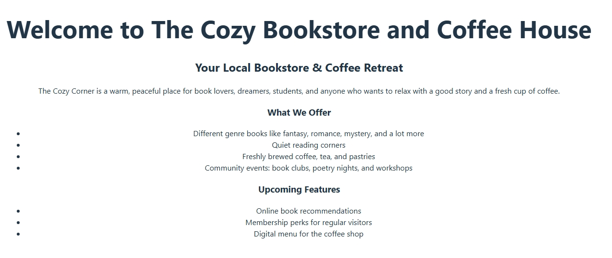

# 🧑‍💼 The Cozy Corner

A cozy bookstore and coffee shop landing page built with **React**.  
This project showcases a simple homepage with information about the bookstore, coffee menu, and upcoming features.

---

## 📌 Task Overview

Create a “Landing Page” for a dream project during the course.  
The task focused on **displaying a static view** using JSX, without complex logic or interactivity.

---

## ✅ Features Implemented

- Homepage layout with headings and paragraphs
- Lists of offerings and upcoming features
- React project structure (`App.jsx`, `main.jsx`)
- Simple styling using default HTML elements

---

## 📊 Screenshots

**Landing Page Preview:**



> (Replace this placeholder with an actual screenshot of your landing page.)

---

## 🚀 How to Run the Project

1. Install dependencies:

```bash
npm install


